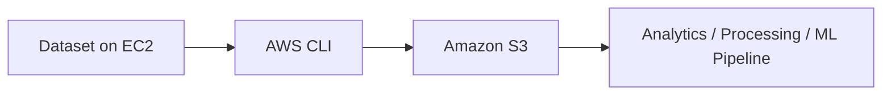

# 🪣 Practical 4 — Transfer Data Between EC2 and Amazon S3

> **Goal:** Create an S3 bucket, give EC2 permission through an IAM role, and upload/download data using AWS CLI.

## Screens Used

```text
AWS Console → IAM
AWS Console → EC2
AWS Console → S3
EC2 Ubuntu Terminal
```

## Main Flow

```text
IAM Role
   ↓
EC2 Instance
   ↓
AWS CLI
   ↓
Amazon S3 Bucket
   ↓
Upload / Download / Verify Data
```

---

## Step 1 — Create an IAM Role for S3 Access

**🌐 WHERE TO GO**  
AWS Console → search **IAM** → **Roles** → **Create role**

**🧭 WHAT TO DO**
1. Trusted entity type → **AWS service**.
2. Use case → **EC2**.
3. Click **Next**.
4. Add an S3 policy required for your lab.
5. Name the role, for example:

```text
EC2-S3-Lab-Role
```

6. Click **Create role**.

**🔐 NOTE**  
For a classroom lab, a broad managed S3 policy may be convenient. For real projects, use a restricted policy that allows only the required bucket/actions.

---

## Step 2 — Launch or Open Your Ubuntu EC2 Instance

**🌐 WHERE TO GO**  
AWS Console → **EC2** → **Instances**

If you need a new instance:

**EC2 → Instances → Launch instances**

Select Ubuntu 24.04 and configure the normal SSH/network settings required for your environment.

**✅ CHECK**  
Wait until the instance shows **Running**.

---

## Step 3 — Attach the IAM Role to EC2

**🌐 WHERE TO GO**  
EC2 → Instances → select the instance

**🧭 WHAT TO DO**
1. Click **Actions**.
2. Choose **Security**.
3. Click **Modify IAM role**.
4. Select:

```text
EC2-S3-Lab-Role
```

5. Click **Update IAM role**.

**✅ CHECK**  
Open the instance details and confirm the IAM role is attached.

---

## Step 4 — Connect to EC2

**🌐 WHERE TO GO**  
EC2 → Instances → select instance → **Connect** → **EC2 Instance Connect** → **Connect**

**✅ CHECK**  
You should see the Ubuntu terminal.

---

## Step 5 — Install AWS CLI v2

**🌐 WHERE TO GO**  
EC2 Ubuntu Terminal

Run these commands one by one:

```bash
sudo apt update -y
```

```bash
sudo apt install -y unzip curl
```

```bash
curl "https://awscli.amazonaws.com/awscli-exe-linux-x86_64.zip" -o "awscliv2.zip"
```

```bash
unzip -q awscliv2.zip
```

```bash
sudo ./aws/install
```

**✅ CHECK**

```bash
aws --version
```

Then confirm the IAM role identity:

```bash
aws sts get-caller-identity
```

**📝 WHAT IT MEANS**  
If `get-caller-identity` returns an ARN, AWS CLI can see the credentials provided by the EC2 IAM role.

---

## Step 6 — Create an S3 Bucket

**🌐 WHERE TO GO**  
AWS Console → search **S3** → **Buckets** → **Create bucket**

Direct entry: https://s3.console.aws.amazon.com/s3/

**🧭 WHAT TO DO**
1. Enter a globally unique bucket name.
2. Choose the AWS Region you want to use.
3. Keep **Block Public Access** enabled unless your lab specifically requires something different.
4. Click **Create bucket**.

Example naming style:

```text
ayan-data-pipeline-lab-2026
```

**✅ CHECK**  
The new bucket should appear in the S3 bucket list.

> From this point onward, replace `YOUR-BUCKET-NAME` with your real bucket name.

---

## Step 7 — Create a Test Data Folder on EC2

**🌐 WHERE TO GO**  
EC2 terminal

**💻 COMMAND**

```bash
mkdir -p ~/data
```

Create a small CSV file:

```bash
cat > ~/data/students.csv <<'EOF'
id,name,score
1,Ayan,88
2,Demo,76
3,CloudLab,91
EOF
```

**✅ CHECK**

```bash
cat ~/data/students.csv
```

You should see the CSV rows in the terminal.

---

## Step 8 — Upload One File to S3

**🌐 WHERE TO GO**  
EC2 terminal

**💻 COMMAND**

```bash
aws s3 cp ~/data/students.csv s3://YOUR-BUCKET-NAME/data/students.csv
```

**📝 WHAT IT DOES**

```text
Local EC2 file
~/data/students.csv
        ↓
S3 object
s3://YOUR-BUCKET-NAME/data/students.csv
```

**✅ CHECK**  
The command should show an `upload:` message.

---

## Step 9 — Upload a Complete Folder

**🌐 WHERE TO GO**  
EC2 terminal

**💻 COMMAND**

```bash
aws s3 cp ~/data/ s3://YOUR-BUCKET-NAME/data/ --recursive
```

**📝 WHAT IT DOES**  
Copies every file inside `~/data/` to the `data/` prefix in your S3 bucket.

---

## Step 10 — Verify Data Using AWS CLI

**🌐 WHERE TO GO**  
EC2 terminal

List the bucket:

```bash
aws s3 ls s3://YOUR-BUCKET-NAME/
```

List the data folder recursively:

```bash
aws s3 ls s3://YOUR-BUCKET-NAME/data/ --recursive
```

**✅ CHECK**  
You should see `students.csv` in the output.

---

## Step 11 — Verify Data in the S3 Website

**🌐 WHERE TO GO**  
AWS Console → **S3** → **Buckets** → your bucket → **Objects**

**🧭 WHAT TO DO**
1. Open the `data/` folder/prefix.
2. Confirm `students.csv` appears.
3. Click the object to view its details if required.

This proves the EC2 → S3 upload worked.

---

## Step 12 — Download a File from S3 Back to EC2

**🌐 WHERE TO GO**  
EC2 terminal

Create a download directory:

```bash
mkdir -p ~/downloads
```

Download the file:

```bash
aws s3 cp s3://YOUR-BUCKET-NAME/data/students.csv ~/downloads/students.csv
```

**✅ CHECK**

```bash
cat ~/downloads/students.csv
```

The file content should match the data uploaded earlier.

---

## Step 13 — Download a Complete S3 Folder

**🌐 WHERE TO GO**  
EC2 terminal

**💻 COMMAND**

```bash
aws s3 cp s3://YOUR-BUCKET-NAME/data/ ~/downloads/data/ --recursive
```

**✅ CHECK**

```bash
find ~/downloads/data -maxdepth 2 -type f -print
```

---

## Step 14 — Understand the Data Pipeline Concept

The lab you just completed represents a simple data movement pipeline:



S3 is commonly used as durable object storage between data collection and later processing stages.

---

## Step 15 — Clean Up

**🌐 WHERE TO GO**

### S3
AWS Console → S3 → Buckets → your test bucket

Delete test objects/bucket only when they are no longer required.

### EC2
AWS Console → EC2 → Instances

Stop or terminate the test instance when the practical is finished.

---

## 🧠 Commands to Remember

```bash
aws sts get-caller-identity
aws s3 ls
aws s3 cp LOCAL-FILE s3://BUCKET-NAME/PATH/
aws s3 cp LOCAL-FOLDER/ s3://BUCKET-NAME/PATH/ --recursive
aws s3 ls s3://BUCKET-NAME/PATH/ --recursive
aws s3 cp s3://BUCKET-NAME/PATH/ LOCAL-PATH/ --recursive
```

## Easy Memory Flow

```text
IAM Role
   ↓
Attach to EC2
   ↓
Install AWS CLI
   ↓
Create S3 Bucket
   ↓
aws s3 cp UPLOAD
   ↓
S3 Console CHECK
   ↓
aws s3 cp DOWNLOAD
```

## 🔐 Important

- Prefer EC2 IAM Roles over `aws configure` credentials on the server.
- Keep S3 Block Public Access enabled for private lab data.
- Never commit credentials to GitHub.
- Replace all placeholders before running a command.
