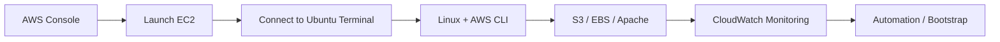

<div align="center">

# ☁️ AWS Cloud Engineering Practicals

### A Beginner-Friendly Hands-on Lab Repository by Ayan Sayyad


**EC2 · S3 · IAM · CloudWatch · EBS · AWS CLI · Apache · Linux · Bash**

</div>

---

## 🚀 Start Here

This repository is designed so that even a beginner can open a practical and follow it from **Step 1 to the final result** without guessing where to click or where to run a command.

Every practical uses the same format:

| Symbol | Meaning | What you should do |
|---|---|---|
| 🌐 **WHERE TO GO** | Website or application | Open AWS Console, EC2 terminal, browser, etc. |
| 🧭 **WHAT TO DO** | Click/navigation instructions | Follow the exact menu or button path |
| 💻 **COMMAND** | Linux/AWS CLI command | Copy and run it in the EC2 terminal |
| 📝 **WHAT IT DOES** | Simple explanation | Understand why you are running the command |
| ✅ **CHECK** | Expected result | Confirm the step worked before continuing |
| ➡️ **NEXT** | Next action | Move to the next numbered step |

> **Golden rule:** Do not jump between steps. Complete the current step, check the result, and only then continue.

---

## 🧰 What You Need

1. An **AWS account**.
2. Access to the **AWS Management Console**: https://console.aws.amazon.com/
3. Basic knowledge of opening a terminal.
4. An Ubuntu 24.04 EC2 instance for terminal-based practicals.
5. A browser for checking Apache websites and AWS service pages.

### The three screens you will use most

```text
1. AWS Management Console  → create/configure AWS resources
2. EC2 Terminal            → run Linux and AWS CLI commands
3. Web Browser             → verify websites and AWS dashboards
```

---

## 🗺️ Recommended Learning Flow



---

## 📚 Practical Index

| # | Practical | Main Screen | What You Learn |
|---:|---|---|---|
| 1 | [AWS CLI Setup on Ubuntu](AWS-CLI-Setup.md) | EC2 Terminal | Install and verify AWS CLI v2 |
| 2 | [Installing Web Server on EC2](Installing%20Web%20Server%20on%20EC2) | AWS Console + EC2 + Browser | Launch EC2 and deploy Apache |
| 3 | [Bootstrap for S3 Access](Bootstrap%20for%20S3-access) | EC2 Launch Wizard | Automate server setup with User Data |
| 4 | [Getting Data on S3 for Data Pipeline](Getting%20Data%20on%20S3%20for%20Data%20Pipeline) | IAM + EC2 + S3 | Transfer files between EC2 and S3 |
| 5 | [CloudWatch Agent Setup on EC2](AWS%20CloudWatch%20Agent%20Setup%20on%20EC2) | IAM + EC2 + CloudWatch | Install and start CloudWatch Agent |
| 6 | [CloudWatch Log Monitoring](CloudWatch%20Log%20Monitoring%20on%20EC2) | EC2 + CloudWatch Logs | Send Ubuntu logs to CloudWatch |
| 7 | [CloudWatch RAM Monitoring](CloudWatch%20RAM%20Monitoring%20on%20EC2) | EC2 + CloudWatch Metrics | Monitor memory using CWAgent |
| 8 | [CPU & System Stress Testing](AWS%20CLI%20and%20System%20Stress%20Testing%20on%20Ubuntu%2024.04) | EC2 Terminal + CloudWatch | Generate and observe system load |
| 9 | [EBS Volume Setup & Mounting](EBS%20Volume%20Setup%20and%20Mounting) | EC2 Console + Terminal | Attach and mount extra storage |

---

## 🧠 How to Read a Practical

Example:

### Step X — Install a Package

**🌐 WHERE TO GO**  
EC2 instance → **Connect** → **EC2 Instance Connect** → **Connect**

**🧭 WHAT TO DO**  
Once the Ubuntu terminal opens, run the command below.

**💻 COMMAND**

```bash
sudo apt update -y
```

**📝 WHAT IT DOES**  
Refreshes Ubuntu's package list so the server knows which package versions are available.

**✅ CHECK**  
The command should finish without a fatal error and return you to the terminal prompt.

**➡️ NEXT**  
Continue to the next numbered step.

This same pattern is used throughout the repository.

---

## 🏗️ Services Covered

### Compute
- Amazon EC2
- Ubuntu server setup
- Security Groups
- EC2 Instance Connect

### Storage
- Amazon S3
- Amazon EBS
- Linux mount points

### Monitoring
- Amazon CloudWatch
- CloudWatch Agent
- Log groups
- RAM metrics
- CPU/system stress testing

### Automation & Web
- EC2 User Data / bootstrap scripts
- AWS CLI v2
- Bash
- Apache2 Web Server

---

## 🔐 Security Rules Used in These Labs

- Never upload **AWS Access Keys**, **Secret Keys**, passwords or private keys to GitHub.
- Prefer **IAM Roles for EC2** instead of saving credentials on a server.
- Use the minimum IAM permissions required for a task whenever possible.
- Do not make an S3 bucket publicly writable.
- Check a disk carefully before using `mkfs`; formatting can erase data.

---

## 💰 Cost Safety

Some AWS resources can continue generating charges while they exist.

After a practical, check:

**AWS Console → EC2 → Instances / Volumes**  
**AWS Console → S3 → Buckets**  
**AWS Console → CloudWatch → Log groups**

Stop, terminate or delete resources that you no longer need.

---

## ✅ Best Way to Practice

```text
Read Step 1
   ↓
Open the screen mentioned in WHERE TO GO
   ↓
Follow WHAT TO DO
   ↓
Run COMMAND if shown
   ↓
Read WHAT IT DOES
   ↓
Confirm CHECK
   ↓
Go to NEXT
```

Do this for every step and the complete practical becomes easy to remember and repeat.

---

<div align="center">

## 👨‍💻 Author

**Ayan Sayyad**  
B.Tech Information Technology  
AWS · Linux · DevOps · Python · Cloud Engineering

**Learning by building real cloud labs, one step at a time.**

</div>
